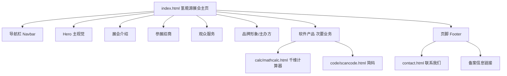

I have all the context I need. Now let me create a comprehensive plan. The task involves:

1. Rewriting `index.html` as a hydrogen energy exhibition business website (primary business)
2. Preserving APP products (千维计算器、简码) as a secondary "软件产品" section
3. Preserving footer/beian/contact info
4. This is a significant UI redesign, so I need a `<design>` section

Since the site is a simple static Jekyll/GitHub Pages site using plain HTML + CSS, I'll design a modern single-page hydrogen exhibition homepage with a clean, premium aesthetic. I'll use the plain HTML approach (no framework) since the existing site is plain HTML/CSS with no build system.

Let me create the plan.

<plan_result>
<req>

## 产品概述

将现有APP开发宣传网站的主页（index.html）重构为一个以**氢能源展会**为核心业务的官方网站，同时将原有的APP产品（千维计算器、简码）降级为次要业务，在主页下方以独立"软件产品"板块展示。展会由**重庆博瑞特会展有限公司**主办/承办。由于暂无氢能源素材，先用占位图与占位文案搭建完整页面结构，后续可替换为真实素材。

## 核心功能（主页区块）

1. **导航栏**：顶部固定导航，包含展会介绍、参展招商、观众服务、软件产品、联系我们等锚点入口，并放置公司/展会品牌LOGO。
2. **展会主视觉（Hero Banner）**：大图轮播/主视觉区，展示氢能源展会品牌口号、展会时间地点、届次、规模等核心信息，含"参展报名/观众注册"CTA按钮。
3. **展会介绍**：展会背景、定位、主题、规模（展商数、展区面积、专业观众等）与历届回顾，突出氢能源产业展示。
4. **参展/招商信息**：展位预订、参展商服务、展区划分、招商合作方式等业务内容，提供报名咨询入口。
5. **观众/参观服务**：观众注册、观展指引、票务、参观须知等，提供注册入口。
6. **企业/品牌形象**：主办/承办方（重庆博瑞特会展有限公司）介绍、氢能源产业价值展示。
7. **软件产品（次要业务）**：保留千维计算器（calc/mathcalc.html）、简码（code/scancode.html）两个产品入口及图标，独立成板块展示。
8. **页脚**：保留版权信息（重庆博瑞特会展有限公司）、联系我们链接（contact.html）、渝公网安备与渝ICP备备案信息（含 ic_pub_security.png 图标）。

## 视觉效果

采用现代、专业、科技感强的展会官网风格，氢能源主题（蓝绿色调），响应式布局，适配PC与移动端。导航栏、展区卡片、CTA按钮等具有流畅的交互与动效。整体布局清晰、大气，突出氢能源绿色能源的产业定位。
</req>

<tech>

## 技术栈

- 静态站点：现有项目为基于 Jekyll（jekyll-theme-cayman）+ GitHub Pages 的纯静态 HTML/CSS 网站，无构建工具、无包管理。为保持与现有项目架构一致，**主页重构继续采用原生 HTML + CSS（单文件），不引入前端框架或构建系统**。
- 语言：简体中文
- 字体：系统字体栈（微软雅黑等），与现有 default.css 保持一致
- 图标：使用内联 SVG 图标（避免外部依赖），或复用现有 PNG 资源

## 实现方案

### 总体策略

采用**单文件单页**方案，重写 `index.html` 为一个完整的长页面（锚点导航 + 分区内容），新增一个 `hydrogen.css`（或直接在 index.html 内联样式）承载展会主页的现代样式，避免改动现有 `default.css` 以免影响其他子页面。氢能源部分用占位图片（如通过渐变背景 + 占位文字，或内联 SVG 占位图）与占位文案搭建。

### 关键决策

1. **样式隔离**：新建独立样式表（如 `hydrogen.css`）仅作用于主页，`default.css` 保持不变，避免影响 calc/、code/、video/ 等子页面。
2. **锚点导航**：使用 `<a href="#xxx">` 锚点实现单页内跳转，导航栏 sticky 固定顶部，页面平滑滚动（CSS `scroll-behavior: smooth`）。
3. **响应式**：使用 Flexbox/Grid 布局 + 媒体查询，在移动端将多列展区卡片折叠为单列，保证在不同屏幕下布局合理。
4. **占位素材**：氢能源无真实图片，采用 CSS 渐变背景 + 语义化占位图标/SVG 占位图 + 占位文案，页面结构完整、视觉美观，便于后续替换真实素材。
5. **次要业务降级**：在主页下方设置"软件产品"板块，用卡片网格展示三个 APP（千维计算器、简码），复用现有 `calc/image/icon.png`、`code/image/icon.png`、`video/image/icon.png` 图标与链接。
6. **保留页脚**：完整保留现有版权、联系我们、渝公网安备、渝ICP备案信息。

### 性能与可靠性

- 单页静态 HTML，无运行时框架开销，加载快速。
- 图片使用固定宽高占位，避免布局抖动。
- 底部备案信息保持与现有一致，避免合规风险。

## 架构设计

纯静态多页面站点，主页(index.html)重写为展会官网首页，通过锚点实现单页导航。结构如下：



## 目录结构

本次改动仅涉及主页与新增样式，不修改现有子页面与 default.css：

```
/Users/Shared/Apache/server/linecloud/
├── index.html      # [MODIFY] 重写为氢能源展会官网主页，含导航、Hero、展会介绍、参展招商、观众服务、品牌形象、软件产品板块、页脚
└── hydrogen.css    # [NEW] 氢能源展会主页专用样式，仅作用于 index.html，含响应式布局、渐变、动效
```

### 文件职责说明

- **index.html [MODIFY]**：整体重构为主页。保留底部版权/备案/联系我们链接；软件产品板块引用现有三个APP链接与图标。氢能源部分采用占位文案与占位图结构。结构区块：导航栏(#nav)、Hero(#home)、展会介绍(#about)、参展招商(#exhibitor)、观众服务(#visitor)、品牌形象(#brand)、软件产品(#software)、页脚(#footer)。
- **hydrogen.css [NEW]**：定义主页现代样式。包含 CSS 变量（氢能蓝绿色系）、导航栏 sticky 与滚动态、Hero 渐变背景、卡片网格布局、CTA 按钮动效、平滑滚动、移动端媒体查询。

## 关键技术结构

```
<!-- 导航栏锚点结构示意 -->
<nav id="nav">
  <a href="#home">首页</a>
  <a href="#about">展会介绍</a>
  <a href="#exhibitor">参展招商</a>
  <a href="#visitor">观众服务</a>
  <a href="#software">软件产品</a>
  <a href="contact.html">联系我们</a>
</nav>

<!-- 软件产品板块复用现有链接与图标 -->
<div class="product-card">
  <a href="calc/mathcalc.html"></a>
  <h3>千维计算器</h3>
  <p>科学函数、自由公式、单位换算</p>
</div>
```

</tech>

<design framework="HTML" component="">
<description>

## 设计风格

采用**现代科技展会官网**风格，突出氢能源绿色能源的产业属性，营造专业、大气、前沿的氛围。

## 风格关键词

- 氢能蓝绿科技风：以蓝绿色渐变为主基调，体现清洁能源的现代科技感
- 深色 Hero + 明亮内容区：顶部主视觉使用深蓝绿渐变与光效，营造高端大气的开场
- 卡片化展区：参展/观众服务等区块使用卡片网格，层次清晰
- 流畅动效：导航栏悬停、按钮呼吸光效、卡片悬浮抬升、平滑滚动
- 大面积留白与分区标题，保证内容可读性与呼吸感

## 页面布局（自上而下区块设计）

1. **导航栏（Navbar）**：顶部固定，左侧为展会/公司LOGO占位，右侧为锚点菜单（首页、展会介绍、参展招商、观众服务、软件产品、联系我们）。滚动后呈现半透明玻璃质感背景。移动端菜单折叠为汉堡按钮。
2. **Hero 主视觉**：全宽渐变深色背景，居中大标题（如"中国国际氢能源产业博览会"占位名）、副标题、展会时间地点、核心数据（展商数/展区面积/观众数），含"参展报名"与"观众注册"两个 CTA 按钮，底部装饰性光效曲线。
3. **展会介绍**：两栏布局，左侧图文介绍展会背景与定位，右侧列出展会规模数据卡片（历届展商、展区面积、专业观众、覆盖国家等），下方为"历届回顾"占位图轮播。
4. **参展招商**：标题 + 多个功能卡片（展位预订、参展商服务、展区划分、招商合作），每卡片含图标、标题、说明文字与"了解详情"链接，下方为招商咨询 CTA。
5. **观众服务**：功能卡片（观众注册、观展指引、票务服务、参观须知），并放置观众注册表单占位区（姓名/联系方式/参观日期）。
6. **品牌形象**：主办/承办方重庆博瑞特会展有限公司介绍 + 氢能源产业价值展示（全产业链示意卡片）。
7. **软件产品（次要业务）**：独立的浅色区块，标题"软件产品"，三个等宽产品卡片（千维计算器、简码），复用现有图标与链接，弱化视觉权重但保持入口清晰。
8. **页脚（Footer）**：深色背景，保留公司名、联系我们链接、渝公网安备（含 ic_pub_security.png）与渝ICP备案链接，与现有页脚信息一致。

## 响应式

- 桌面端（≥768px）：导航横向菜单、Hero 大标题、多列卡片网格
- 移动端（<768px）：导航折叠为汉堡菜单、卡片单列堆叠、CTA 按钮全宽
</description>
<style_keywords>
<keyword>现代科技展会风</keyword>
<keyword>氢能蓝绿渐变</keyword>
<keyword>深色Hero</keyword>
<keyword>卡片化布局</keyword>
<keyword>流畅动效</keyword>
<keyword>响应式</keyword>
</style_keywords>
<font_system fontFamily="PingFang SC, Microsoft YaHei, sans-serif">
<heading size="40px" weight="700"></heading>
<subheading size="24px" weight="600"></subheading>
<body size="15px" weight="400"></body>
</font_system>
<color_system>
<primary_colors>
<color>#0B7A75</color>
<color>#12A89D</color>
<color>#0E3A5C</color>
</primary_colors>
<background_colors>
<color>#F5F8FA</color>
<color>#FFFFFF</color>
<color>#0B1E2B</color>
</background_colors>
<text_colors>
<color>#1A2B36</color>
<color>#FFFFFF</color>
<color>#5A6B7A</color>
</text_colors>
<functional_colors>
<color>#12A89D</color>
<color>#E05C3A</color>
<color>#2F9E44</color>
</functional_colors>
</color_system>
</design>

<extensions>

## Agent 扩展

### Skill

- **多模态内容生成**：用于为氢能源展会主页生成占位/正式的宣传图片素材（如 Hero 主视觉图、展会场景插画、氢能产业展示图），弥补当前"暂无素材"的缺口，使页面视觉更加完整。
- 用途：在搭建主页过程中或后续优化时，生成氢能源展会相关的视觉占位素材。
- 预期产出：可用的氢能展会主视觉/配图素材，替换或增强现有占位结构。
</extensions>

<todolist>
<item id="create-hydrogen-css" deps="">新建 hydrogen.css，定义氢能蓝绿渐变、卡片网格、导航、动效与响应式样式</item>
<item id="rewrite-index" deps="create-hydrogen-css">重写 index.html，搭建导航、Hero、展会介绍、参展招商、观众服务、品牌形象区块（含占位文案与CTA）</item>
<item id="software-section" deps="rewrite-index">在主页新增软件产品板块，引用千维计算器、简码的现有图标与链接</item>
<item id="footer-and-links" deps="rewrite-index">保留并完善页脚版权、联系我们、渝公网安备与渝ICP备案信息</item>
<item id="responsive-check" deps="create-hydrogen-css,rewrite-index">校验页面响应式布局与锚点跳转，修复移动端显示与交互问题</item>
</todolist>
</plan_result>